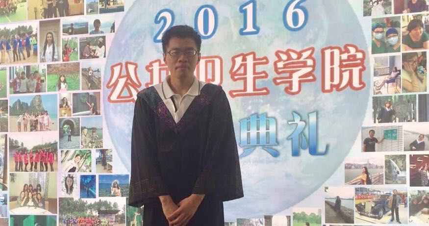

 

 

I am currently pursuing my MS in Biostatistics at [Columbia University Mailman School of Public Health](https://www.mailman.columbia.edu/). I am conducting research with [Gen Li](https://sites.google.com/view/ligen) at the [Department of Biostatistics at Columbia University](https://www.mailman.columbia.edu/become-student/departments/biostatistics) and [Jeffrey Shaman](http://blogs.cuit.columbia.edu/jls106/) in the [Department of Environmental Health Sciences at Columbia University](https://www.mailman.columbia.edu/become-student/departments/environmental-health-sciences-ehs). 

Prior to switching careers into statistics, I received a M.D in preventive medicine [Fudan University](http://www.fudan.edu.cn/en/), then moved to New York and worked on the regulatory side of clinical research at Memorial Sloan Kettering Cancer Center for 3 years before starting graduate school. 

###Resume
My resume is available <a href="Downloads/2017-12-25_JIayi_CV.pdf">here</a>.

###Contact Information

Email: jj2876@cumc.columbia.edu