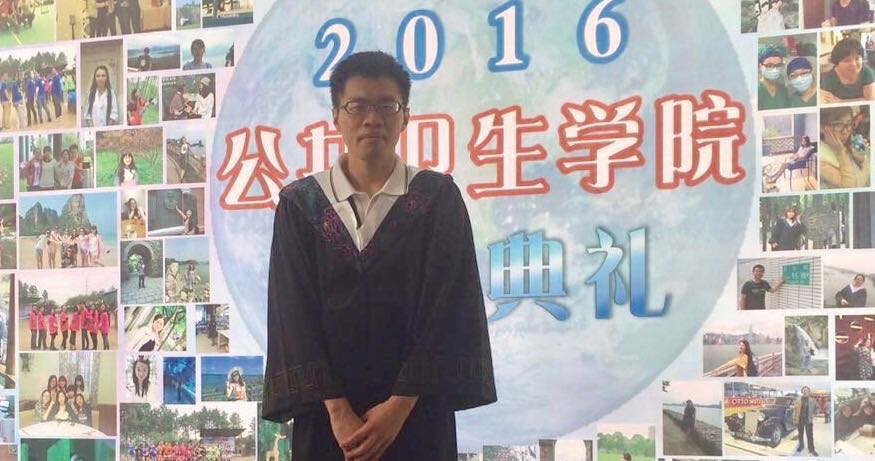

<center></center>

<br>

I hold a M.D. in Preventive Medicine at [Fudan University](http://www.fudan.edu.cn/en/), and I am currently pursuing my MS degree in biostatistics at [Columbia University Mailman School of Public Health](https://www.mailman.columbia.edu/). My goal is to become an outstanding data analyst. 


###Resume
My resume is available <a href="Downloads/2017-12-25_JIayi_CV.pdf">here</a>.

###Contact Information

Email: jj2876@cumc.columbia.edu

```{r, echo = FALSE, out.width = "100%", warning=FALSE, include = FALSE}
library(knitr)
knitr::include_graphics("./Photo/Personal Photo.jpg")

#I am a current Master's Student in Biostatistics at Columbia University, interested in clinical research and statistical genetics. 
```