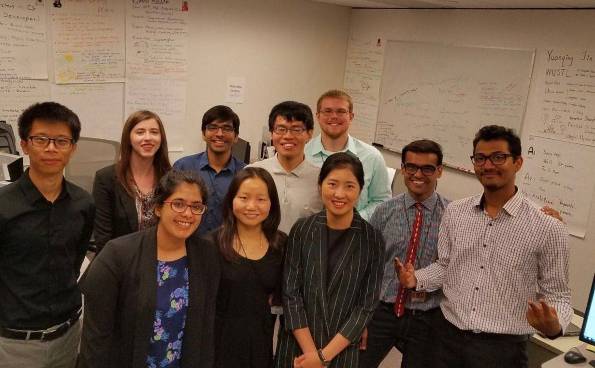

 

In the summer of 2017, I interned at [Data Sciences & Analytics Group](https://www.pnnl.gov/nationalsecurity/technical/capabilities/computing/data_sciences.stm) at [Pacific Northwest National Laboratory](https://www.pnnl.gov/). I collaborated with designers and programmers to produce a bio-surveillance web application, which will give real-time risk assessment for each news related to zoonotic diseases.

My principal contributions to team effort includes:

1.	Search and read the literature about animal disease and risk assessment for it.
2.	Learn different statistical methods about risk assessment for animal health.
3.	Communicate the methods to our teammates and lead the discussions to decide which methods to use for our app.
4.	Translate the statistical methods to python codes to help Jacob write the codes more efficiently.
5.	Compile and write the documentation of our app to help our teammates understand the big picture of our app.
